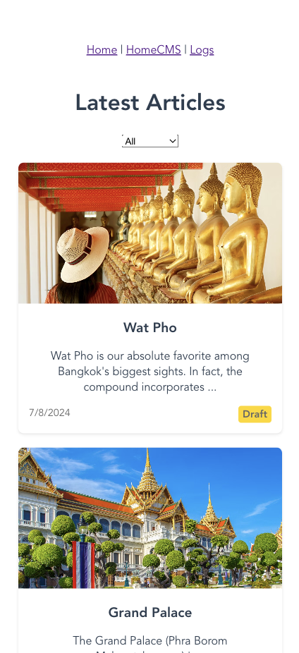

# cmsClaude

Created from Claude.ai

## Tech Stack

Backend: go + mongodb + jwt + cors

Frontend: vue.js + vue-router + axios + vue

Apps: flutter + dart

## Features

- Login
- Create Article
- Update Article
- Delete Article
- View Article
- View Logs (System Logs)
- View Admin Actions (Create User, Delete User)
- User Roles (Admin, User)
- Flutter Apps support (Web, Android, iOS), Responsive UI

## Screenshots



## Backend

### Install

```bash
go get github.com/golang-jwt/jwt
go get github.com/gorilla/mux
go get github.com/rs/cors
go get go.mongodb.org/mongo-driver
```

### Run

```bash
go run main.go
```

## Frontend

### Install

```bash
npm install
```

### Run

```bash
npm run serve
```

## Apps

### Install

```bash
flutter create .
```

### Run

```bash
flutter run
```